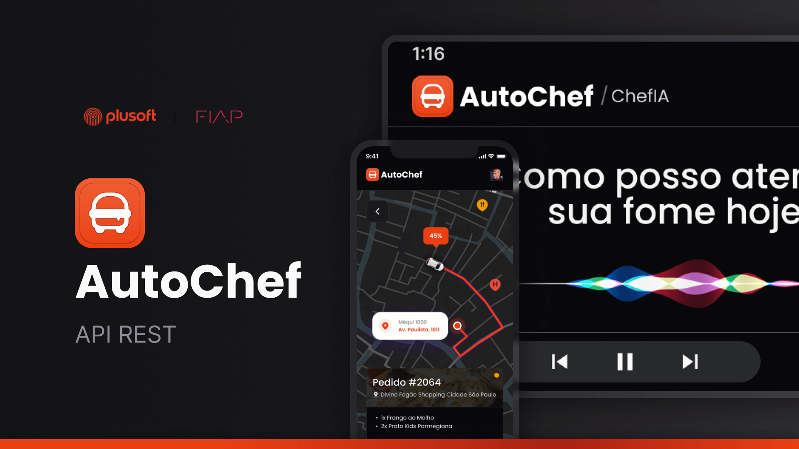
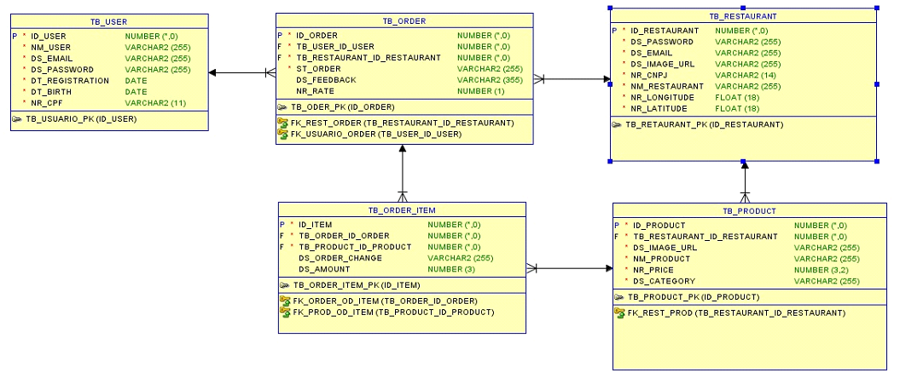

# 🧑‍🍳 Autochef



## 💡Explicação do projeto
O AutoChef surge como resposta a uma lacuna significativa no setor de pedidos de alimentos via Drive Thru, especialmente em ambientes urbanos movimentados. Identificamos que muitos consumidores enfrentam desafios ao utilizar o serviço de Drive Thru, como a necessidade de fazer pedidos antecipados, a falta de personalização e recomendações de alimentos, além das longas filas e demoras para retirada dos pedidos.

O problema central reside na falta de uma solução integrada que permita aos clientes realizar pedidos personalizados com antecedência e priorizar a entrega de acordo com a distância, evitando filas e demoras no Drive Thru. A ausência de um sistema eficiente de recomendação de alimentos também contribui para uma experiência insatisfatória para os consumidores.

Além disso, as empresas de alimentos e restaurantes enfrentam dificuldades em atender às demandas dos clientes de forma eficiente e personalizada, devido à falta de insights sobre as preferências individuais dos consumidores.

Portanto, o AutoChef busca resolver esses desafios ao oferecer uma plataforma inovadora que permite aos usuários fazerem pedidos personalizados com antecedência, priorizando a entrega de acordo com a distância e fornecendo recomendações de alimentos relevantes, garantindo uma experiência de Drive Thru mais conveniente e satisfatória tanto para os consumidores quanto para as empresas com a utilização de Inteligência Artificial Generativa e Deep Analytics.

Você pode acessar o [vídeo pitch de apresentação do projeto](https://www.youtube.com/watch?v=eDRL7UrAchQ) para obter mais informações.

## 👥 Equipe
Este projeto está sendo desenvolvido pelos seguintes integrantes da turma 2TDSPV:

- RM98110 - André Rohregger Machado `(Desenvolvedor .NET)`
- RM99565 - Erick Nathan Capito Pereira `(Desenvolvedor Full-stack)`
- RM552029 - Renato Atanes `(Engenheiro DevOps e Analista de Qualidade)`
- RM551886 - Victor Luca do Nascimento Queiroz `(Desenvolvedor JAVA)`
- RM99455 - Vinícius Martins Torres Abdala `(DBA e Cientista de dados)`

## 📅 Cronograma
| Etapa | Entrega |
| --- | --- |
| 1 (15/04/2024) | Criação da aplicação base (Models, Repositories e Controllers) |
| 2 (13/05/2024) | Criação dos relacionamentos e validações |

## 💻 Tecnologias
O back-end Java do projeto está sendo desenvolvido desenvolvido utilizando as seguintes tecnologias:

- [Java 17+](https://www.oracle.com/java/technologies/javase/jdk17-archive-downloads.html)
- [Maven](https://maven.apache.org/)
- [Lombok](https://projectlombok.org/)
- [Spring Boot](https://spring.io/projects/spring-boot)
- [Spring Web](https://spring.io/web-applications)
- [Spring Data JPA](https://spring.io/projects/spring-data-jpa)
- [Oracle Driver](https://www.oracle.com/br/database/technologies/appdev/jdbc.html)

## ⚙️ Como executar a aplicação

Para executar a aplicação AutoChef, siga estas etapas:

1. **Clone o repositório:**
   ```bash
   git clone https://github.com/auto-chef/backend.git
   ```

2. **Acesse o diretório do projeto:**
   ```bash
   cd backend
   ```

3. **Instale as dependências:**
   Certifique-se de ter o Maven instalado. Em seguida, execute:
   ```bash
   mvn install
   ```

4. **Configure o banco de dados:**
   Configure as credenciais do banco de dados no arquivo `application.properties`.

5. **Execute a aplicação:**
   ```bash
   mvn spring-boot:run
   ```

Agora, a aplicação AutoChef está em execução localmente em seu ambiente.

## 📄 Documentação
Você pode fazer o download e executar a documentação no Insomnia clicando no botão a seguir:

[](https://insomnia.rest/run/?label=AutoChef%20API&uri=https%3A%2F%2Fgithub.com%2Fauto-chef%2Fbackend%2Fblob%2Fmain%2F.github%2Fdocumentacao-rest.json)

## 📊 Diagramas


